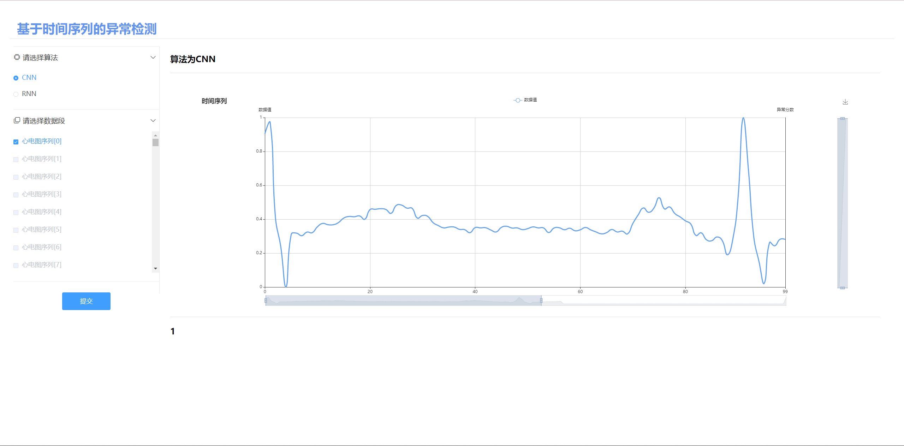

## 第六周工作整理

### 前后端连接

* 将数据集进行处理后，按照前端同学的要求将数据传给前端显示

```python
# 发送数据集具体数据给前端
def send_dataset(range_selected=0):
    global is_init
    if is_init == 0:
        init_val()
        is_init = 1

    dataset_send = []

    for i in range(0, len(dataset[range_selected])):
        dataset_send.append([i, dataset[range_selected][i]])
    return dataset_send, labels[range_selected]
  
# 发送数据集的属性
def send_dataset_param():
    global is_init
    if is_init == 0:
        init_val()
        is_init = 1
    return len(dataset) * len(dataset[0]), len(dataset[0]), 1
```

* 由于原先模型在训练和评估前，会将数据集随机打乱，直接传数据会造成前端选择的数据序号和实际评测的不符，因此通过init()方法，只进行一次随机打乱数据

```python
def init_val():
    global dataset
    global labels
    global is_init

    # load normal and abnormal egc from csv files
    normal = np.array(pd.read_csv(
        "D:\Code\PyCharm\AnomalyDetection\TimeseriesAnomalyDetection\ECG\dataset\data\\normal.csv"))
    abnormal = np.array(pd.read_csv(
        "D:\Code\PyCharm\AnomalyDetection\TimeseriesAnomalyDetection\ECG\dataset\data\\abnormal.csv"))
    # balance the dataset
    min_shape = min(normal.shape[0], abnormal.shape[0]) - 1
    normal = normal[0:min_shape]
    abnormal = abnormal[0:min_shape]
    # get the requested split (train or validation)
    normal = normal[int(normal.shape[0] * 0.8):]
    abnormal = abnormal[int(abnormal.shape[0] * 0.8):]

    # generate labels
    normal_labels = np.zeros((normal.shape[0]))
    abnormal_labels = np.ones((abnormal.shape[0]))

    X = np.concatenate((normal, abnormal))
    Y = np.concatenate((normal_labels, abnormal_labels))
    X, Y = shuffle_in_unison(X, Y, seed=9)

    dataset = X
    labels = Y
    is_init = 1
```

* 在前端展示时，计划一次显示**一段**ECG数据，并给出评测结果，而不需要一次测多组数据给出准确率，因此对evalutae()方法进行调整

```python
def evaluate(eval_index=0):
    _, ds = get_tf_dataset()
    path = os.path.join("D:\\TongJi University\\AnomalyDetection\\TimeseriesAnomalyDetection\\ECG\\tmp",
                        "supervised")
    model = tf.keras.models.load_model(path)

    total = 0
    success = 0
    fp = 0
    fn = 0
    tp = 0
    tn = 0

    count = 0
    msg = ""

    for x, y in tqdm(ds, desc="evaluating"):

        if count != eval_index:
            count += 1
            continue
        count += 1

        y_pred = model(x)
        for i in range(y.shape[0]):
            total += 1
            print("y_true:{},y_pred:{}".format(y[i], y_pred[i]))
            l_pred = np.argmax(y[i])
            l_true = np.argmax(y_pred[i])
            if l_pred == l_true:
                success += 1
                if l_pred == 0:
                    msg = "假阳性"
                    tp += 1
                else:
                    # 该数据为异常，且成功检测
                    msg = "真阳性"
                    tn += 1
            else:
                if l_pred == 0:
                    msg = "假阴性"
                    # 该数据为异常，且未检测出
                    fp += 1
                else:
                    msg = "真阴性"
                    fn += 1

            if count == eval_index + 1:
                break

    print("#################################")
    accuracy = success / total
    precision = tp / (tp + fp)
    recall = tp / (tp + fn)
    print("accuracy:{}\nprecision:{}\nrecall:{}".format(accuracy, precision, recall))
    print("#################################")

    return msg
```

### 前端界面展示



### 目前遇到的问题

1. 模型训练还没完成，目前还没有将模型和前后端连接起来