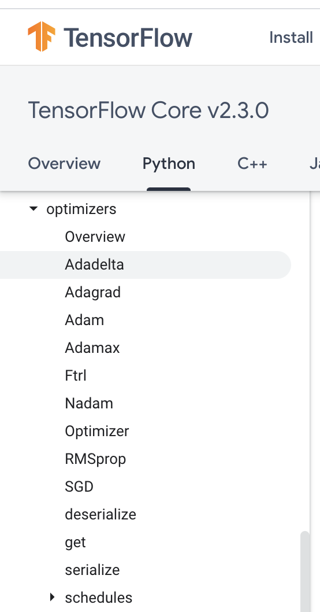
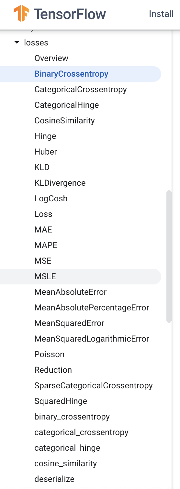
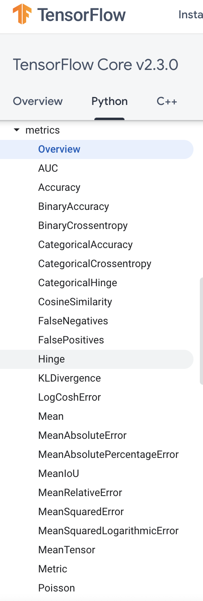

# TSI+CNN训练及使用手册

## Compile Model

* **optimizer**: 可以是字符串形式给出的优化器名字，也可以是函数形式，使用函数形式可以设置学习率、动量和超参数

  - [ ] “**sgd**”  或者

    ```python
     tf.optimizers.SGD(lr = 学习率, decay = 学习率衰减率, momentum = 动量参数）
    ```

  - [ ]  “**adagrad**" 或者 

    ```python
    tf.keras.optimizers.Adagrad(lr = 学习率,  decay = 学习率衰减率）
    ```

  - [ ]  ”**adadelta**" 或者 

    ```python
    tf.keras.optimizers.Adadelta(lr = 学习率, decay = 学习率衰减率）
    ```

  - [x] “**adam**" 或者

    ```python
     tf.keras.optimizers.Adam(lr = 学习率, decay = 学习率衰减率）
    ```

  - [ ] others(maybe you need Scientific Internet Access)

    

    [tf.keras.optimizers]: https://www.tensorflow.org/api_docs/python/tf/keras/optimizers

* **loss**: 可以是字符串形式给出的损失函数的名字，也可以是函数形式

  ​		⚠️可能是版本缘故，必须使用损失函数的名字（下面加粗的部分），而不能直接调用函数，否则会报错

  - [ ] ”**mse**" 或者

    ```python
     tf.keras.losses.MeanSquaredError()
    ```

  - [ ]  "**sparse_categorical_crossentropy**" 或者 

    ```python
    tf.keras.losses.SparseCatagoricalCrossentropy(from_logits = False)
    ```

  - [x] "**binary_cross_entropy**"或者

    ```python
    tf.keras.losses.BinaryCrossentropy()
    ```

  - [ ] others(maybe you need Scientific Internet Access)

    

    [tf.keras.losses]: https://www.tensorflow.org/api_docs/python/tf/keras/losses

* **metrics**: 标注网络评价指标

  - [x] "**accuracy**" : y_ 和 y 都是数值，如y_ = [1] y = [1] #y_为真实值，y为预测值_
  
  - [ ] “**sparse_accuracy**":y_和y都是以独热码 和概率分布表示，如y_ = [0, 1, 0], y = [0.256, 0.695, 0.048]
  
  - [ ] "**sparse_categorical_accuracy**" :y_是以数值形式给出，y是以 独热码给出，如y_ = [1], y = [0.256 0.695, 0.048]
  
  - [ ] others
  
    
  
    [tf.keras.optimizers]: https://www.tensorflow.org/api_docs/python/tf/keras/optimizers
  
    
## EarlyStopping  


## Fit/Train

