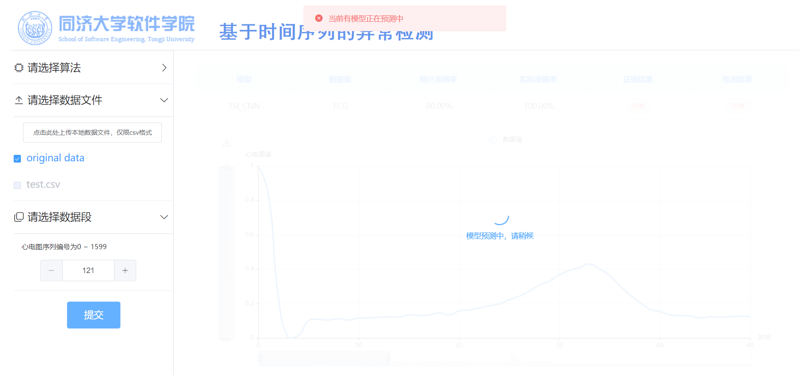

# 第十三周工作

### 1. 为RNN模型设置更加合理的评价机制

考虑到RNN模型相关数据集中异常分布较为集中，采用准确率来度量模型效果不够合理，因此使用AUC来进行评估。本周在系统中添加了AUC值计算的部分并同步更新了前端相关显示。

### 2. 最后优化，完成异常检测系统

至此，系统功能均已实现，为了更好的使用体验，做了最后优化，包括添加了操作错误的提示信息，优化了页头的显示，为图表添加了图例信息等。

