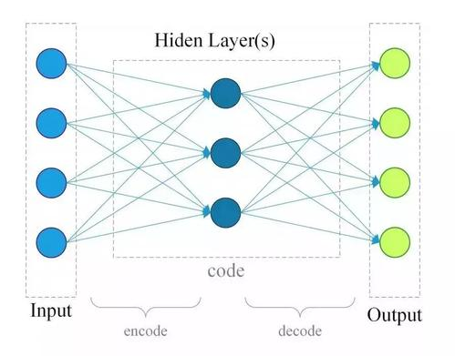
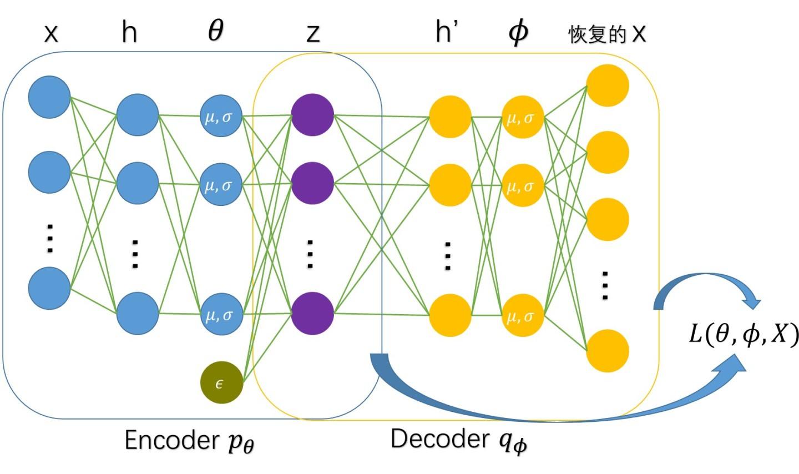
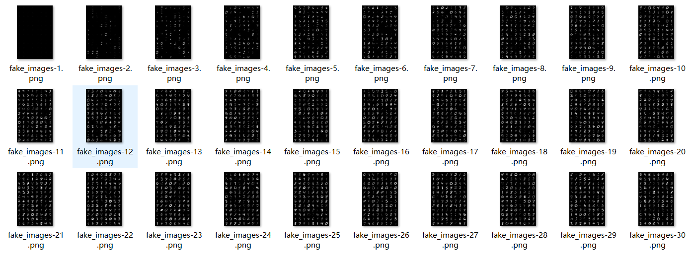
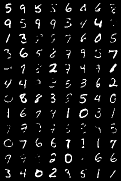

# 第二周工作


### 1 VAE模型的简介

##### 1.1 自编码器（Auto Encoder，AE）

自编码器是一类在半监督学习和非监督学习中使用的人工神经网络，其功能是通过将输入信息作为学习目标，对输入信息进行表征学习，其组成分为编码器（Encoder）和解码器（Decoder）两部分。自编码器被应用于降维、异常检测和计算机视觉领域（图像去噪、神经风格迁移等）。



##### 1.2 变分自编码器 （Variational Auto Encoder, VAE)

按照学习范式，自编码器可以分为收缩自编码器、正则自编码器和变分自编码器三类，VAE即为其中之一。与前两类不同，VAE属于生成网络（与识别网络不同，生成网络通过学习与训练后进行目标的模拟生成与伪造），从这一点上来看，VAE和GAN在实现效果上有着相似之处。VAE与AE的最大的区别是：AE结果映射成一个向量，而VAE结果映射成两个向量，一个向量表示分布的平均值，另外一个表示分布的标准差，两个向量都是相同的高斯分布。这一个区别造成的最大的一个结果就是AE与VAE的损失函数不相同，即VAE在计算损失函数时，除了要计算自编码器本身的重建损失之外，还要加上KL散度。



##### 1.3 VAE与异常检测

VAE是异常检测中常用的一种模型，在实际使用时，将使用VAE生成的数据与待检测的数据（测试数据集）进行对比，那么将生成数据看做正常值来得到测试数据集中的异常值。


### 2 MNIST数据集

MNIST 数据集来自美国国家标准与技术研究所 (NIST)， 训练集 (training set) 由来自 250 个不同人手写的数字构成,，其中 50% 是高中学生，50% 来自人口普查局的工作人员，测试集(test set) 也是同样比例的手写数字数据。该数据集由60000个训练样本和10000个测试样本组成，每个样本都是一张28 * 28像素的灰度手写数字图片，下载后有4个文件，内容如下：

|        文件名称         |   大小   |         内容         |
| :---------------------: | :------: | :------------------: |
| train-images-idx3-ubyte | 45938 kb |    60000张训练集     |
| train-labels-idx1-ubyte |  59 kb   | 训练集图片对应的标签 |
| t10k-images-idx3-ubyte  | 7657 kb  |    10000张测试集     |
| t10k-labels-idx1-ubyte  |  10 kb   | 测试集图片对应的标签 |


### 3 项目内容与介绍

##### 3.1 项目简介

本次的模型基于VAE变分自编码器和MNIST数据集，使用Pytorch，进行若干轮次的训练（可以任意指定），每完成一次训练，生成一张伪造的图片。

##### 3.2 数据集的导入

数据集使用从网络下载导入的方式，从MNIST官方网站下载后保存在 “./data/MNIST/” 路径下。

```python
trainset = torchvision.datasets.MNIST(root='./data', train=True, download=True, transform=transform)
trainloader = torch.utils.data.DataLoader(trainset, batch_size=128, shuffle=True)

testset = torchvision.datasets.MNIST(root='./data', train=False, download=True, transform=transform)
testloader = torch.utils.data.DataLoader(testset, batch_size=100, shuffle=False)
```

##### 3.3 VAE类的定义

VAE类定义了五个方法（包括了一个构造函数），其中forward方法为执行的入口。

```python
class VAE(nn.Module):
    def __init__(self):  

    def encode(self, x):  
        
    def reparametrization(self, mu, logvar): 

    def decode(self, z):

    def forward(self, x):

```

##### 3.4 损失函数的定义

损失函数包括两个部分：自编码器的重构损失（使用BCE损失函数获取）和KL散度。

```python
def loss_function(recon_x, x, mu, logvar):
    BCE_loss = nn.BCELoss(reduction='sum')   # 使用BCE损失函数
    reconstruction_loss = BCE_loss(recon_x, x)
    KL_divergence = -0.5 * torch.sum(1+logvar-torch.exp(logvar)-mu**2)
    #KLD_ele = mu.pow(2).add_(logvar.exp()).mul_(-1).add_(1).add_(logvar)
    #KLD = torch.sum(KLD_ele).mul_(-0.5)
    print(reconstruction_loss, KL_divergence)
    return reconstruction_loss + KL_divergence
```

##### 3.5 单轮训练过程

```python
def train(epoch):
    vae.train()
    all_loss = 0.
    # 遍历所有的训练数据集
    for batch_idx, (inputs, targets) in enumerate(trainloader):
        inputs, targets = inputs.to('cpu'), targets.to('cpu')
        # 将输入内容推平为一维向量
        real_imgs = torch.flatten(inputs, start_dim=1)
        # 训练判断器，利用生成的图片去计算损失函数的值
        gen_imgs, mu, logvar = vae(real_imgs)
        loss = loss_function(gen_imgs, real_imgs, mu, logvar)
        optimizer.zero_grad()    # 梯度置零
        loss.backward()          # 反向传播
        optimizer.step()         # 单次优化
        all_loss += loss.item()  # 统计损失
        print('Epoch {}, loss: {:.6f}'.format(epoch, all_loss/(batch_idx+1)))
    # 每轮训练后将生成的伪造图片保存在MNIST_FAKE目录下
    fake_images = gen_imgs.view(-1, 1, 28, 28)
    save_image(fake_images, 'MNIST_FAKE/fake_images-{}.png'.format(epoch + 1))
```

##### 3.6 总体过程

总体过程为导入数据集、定义VAE类和优化器optimizer、执行指定轮训练，保存模型结果

```python
# 导入数据集，具体内容同3.2
'''
trainset = ......
trainloader = ......
testset = ......
testloader = ......
'''

# 定义VAE类对象和optimizer
vae = VAE()
optimizer = torch.optim.Adam(vae.parameters(), lr=0.0003)  # 使用Adam优化算法

# 执行若干轮训练（这里定义为30轮，训练时间大约15分钟）
for epoch in range(30):
    train(epoch)

# 存储训练模型
torch.save(vae.state_dict(), './vae.pth')
```

##### 3.7 运行结果 

运行30轮训练时每轮的生成图片的演变过程大致如下：



其中，第30轮的结果为：

