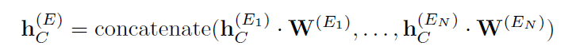

# 第四周工作

**工作内容：**阅读论文

**论文题目：**Outlier Detection for Time Series with Recurrent Autoencoder Ensembles

**论文时间：**2019年

**发表会议：**International Joint Conference on Artificial Intelligence (IJCAI)

## 1. 论文简介

​		本文提出了两种基于循环自编码器集成(Recurrent Autoencoder Ensembles)来解决基于时间序列的异常检测的问题。本论文中使用了利用稀疏连接递归神经网络(S-RNNs)构建的自编码器(Autoencoder)，产生多个具有不同神经网络连接结构的自编码器。这种方法的目的是旨在 **解决某些情况下自动编码器对异常值过度拟合造成对整体质量的影响** 。

## 2. 理论基础

#### 2.1. 集成自编码器

​		集成自编码器的目的是提高基于自编码器的异常检测的准确性，其主要思想是建立一组自编码器，在检测异常值时考虑来自多个自动编码器的重构误差，进而减小由于单个自动编码器产生的偶然误差所带来的误差。在集成时往往不会选择一组网路结构完全相同的自动编码器，这对减少误差几乎没有帮助，在实际使用时，对每个自动编码器随机删除一些连接得到稀疏自编码器，最终得到的集成组合是由多个网络结构不同的稀疏自编码器组成，使用这种集成自编码器有助于降低整体重建误差的方差，有助于提高结果准确性。

​		但是集成自编码器只能用于非序列数据，因此其不能用于时间序列这种序列数据，因此欲使之用于基于时间序列的异常检测，需要对此进行修改。

#### 2.2. S-RNN集成自编码器

##### 2.2.1. 独立框架 (Independent Framework, IF)

​		下图显示了一个S-RNN自编码器集成的基本的、独立的框架。集成包含N个S-RNN自编码器，每个自编码器由一个编码器E~i~ 和一个解码器D~i~ 组成，每个自动编码器有其不同的稀疏权值向量。

​		通过最小化目标函数J，对集合中的每个自编码器按照衡量了原始时间序列中输入向量与重构后的向量的差异的**最小化目标函数**进行独立训练：

##### 2.2.2. 交互框架 (Shared Framework, SF)

​		前一个框架独立地训练不同的自动编码器，这意味着不同的自动编码器在训练阶段不会相互影响。然而，由于所有的自动编码器都试图重构相同且原始的时间序列，这些自编码器之间还是可以找到相关联的内容的。因此本论文提出了一个共享的框架，该框架包含了不同a自编码器之间的交互，假如给定N个模块，其中每个模块来重构原始时间序列，并用交互层（shared layer）来完成这N个模块的交互，框架结构如下图所示：

​		共享层 h~C~^(E)^ 使用线性权重矩阵 **W**^(E)^ 来对所有编码器进行连接：

​		每个解码器 D~i~ 在重构时间序列时将连接隐藏层（共享层 h~C~^(E)^ ）视作初始隐藏状态 (initial hidden state)。在交互网络中，所有自编码器使用最小化目标函数来共同训练，这个函数包括了每个自编码器的重建误差和交互隐藏层的L1正则项两部分，表达式为：

​		在公式中的 λ 表示控制 L1正则项 ||**h**~C~^(E)^||~1~重要性的权重，在本模型中L1正则项起到使共享隐藏状态 **h**~C~^(E)^ 稀疏的作用，这避免了某些编码器过度拟合原始时间序列的情况并且有助于增强解码器的鲁棒性，使之不易受到异常的干扰，这样原始时间序列与重建时间序列的差异就更加显著了。

## 3. 实验内容

#### 3.1. 使用数据集

​		相关实验使用两个真实世界的时间序列数据集，这两个数据集都具有可用的标签，但是与无监督设置一致的是，我们不将这些标签用于训练，而仅用于评估准确性。

##### 3.1.1 Numenta Anomaly Benchmark (NAB)

​		NAB是一个单变量数据集，由6组来自不同领域的时间序列组成，每组约有10个单变量时间序列，每个时间序列包含5000 - 20000个观测值。

##### 3.1.2. Electrocardiography (ECG)

​		ECG是一个多变量数据集，由来自7个病人的7个三维时间序列组成，每组包含3750到5400个观察数据。

#### 3.2. 实验内容

##### 3.2.1. 现有解决方案

​		论文中使用7种方法比较独立框架 (LF) 与交互框架 (SF) 的效果：

​		(1) 局部异常因子 (LOF)，一种著名的基于密度的离群检测方法；

​		(2) 单分类支持向量机 (SVM)，一种基于内核的方法；

​		(3) Isolation Forest (ISF) ；

​		(4) Matrix Profile I (MP)，一种最新的相似性异常检测方法；

​		(5) RandNet (RN)，使用最先进的面向非序列数据前馈集成自编码器；

​		(6) 基于自编码器的卷积神经网络 (CNN)，将时间序列转化为图像再使用 CNN 自编码器进行图像重建；

​		(7) 基于自编码器的长短期记忆神经网络 (LSTM)，是一种最新的基于时间序列的深度学习异常检测方法。

##### 3.2.2. 具体实现

​		所有算法使用Python3.5实现，使用的相关框架包括 TensorFlow 1.4.0 和 Scikit-learn 1.19，项目源码地址   https://github.com/tungk/OED。

##### 3.2.3. 评价机制

​		确定时间序列中哪些向量是异常值的一个典型方法是设置一个阈值并考虑其异常值分数超过临界值的向量。借助为评估非序列数据的集成自编码器的评估策略，使用了两个考虑所有阈值的机制：PR-AUC 和 ROC-AUC。这两个度量不依赖于特定的阈值。相反，它们反映了真阳性、真阴性、假阳性和假阴性之间的全面权衡。

#### 3.3. 实验结果

##### 3.3.1. 总体结果

1.  基于深度学习的方法在大多数情况下表现更好，这说明基于深度学习的方法具有较低的假阳性率和较高的真阴性率，这是异常检测所需要的。
2.  SF和IF优于RN，表明S-RNN集成自编码器比前馈集成自编码器更适合序列数据。
3.  两种被提出的集成方法在大多数情况下优于单独的方法。特别是在单变量和多变量时间序列上，IF和SF在大多数情况下都优于其他方法。
4.  SF在平均时间序列上的表现优于IF。

##### 3.3.2. 自编码器数量的影响

​		随着自编码器数量N的增加，两种集成框架都能获得更好的结果，这表明在一个集成中有更多具有不同结构的自编码器可以产生更好的精度。

##### 3.3.3. IF和SF的比较

​		如果两个框架都有相同的自编码器，SF的性能会更好。这表明，以共享的多任务方式学习多个自编码器确实是有帮助的。然而，SF的一个缺点是它的高内存消耗，这是因为它需要将许多自编码器训练在一起，交互层在继续进行解码阶段之前需要合并所有自编码器的最后状态。

## 4. 结论与展望

​		本论文提出了两种可用于用于时间序列无监督异常检测的基于稀疏循环神经网络的自编码器集成框架。其中一个框架独立地训练多个自动编码器，而另一个框架以多任务学习的方式联合训练多个自动编码器。实验研究表明，所提出的集成自编码器是有效的，优于基准线和最新的方法。

​		本论文最后还提出了进一步提高精确度的研究与设想，主要思路集中在研究不同的自编码器结构上，包括使用去噪自编码器和使用更高级的深度神经网络结构。