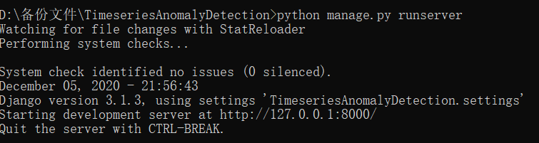
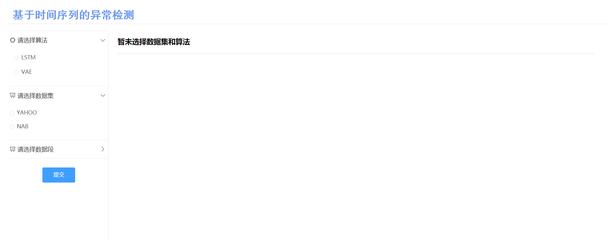

# 第五周工作

### 1. 基于Django的网络框架的搭建

本周使用Django3.1.3 + Python3.6搭建了本项目的基本网络框架，框架搭建与运行过程分为下面几个步骤：

第一步，使用`pip`安装Django，在命令行中输入如下指令安装：

```shell
pip install Django=3.1.3
```

第二步，创建Django项目，可以使用PyCharm专业版直接创建，也可以输入以下指令构建：

```shell
django-admin startproject TimeseriesAnomalyDetection
```

创建后，生成的项目结构如下：

```
TimeseriesAnomalyDetection
│  db.sqlite3
│  manage.py
│
├─static
│
├─templates
│      index.html
│
└─TimeseriesAnomalyDetection
    │  asgi.py
    │  settings.py
    │  urls.py
    │  views.py
    │  wsgi.py
    │  __init__.py
    └─
```

其中db.sqlite3是相关的数据库文件（在本项目中未使用），manage.py为系统与项目的交互通道，static存放静态全局文件（包括图片、css/js库文件等），templates包含所有前端页面文件，项目同名文件夹存放所有Python后端文件，其中asgi.py为一个 ASGI 兼容的 Web 服务器的入口，wsgi.py为一个 WSGI 兼容的 Web 服务器的入口，settings.py为项目配置文件，urls.py为项目的URL声明文件，views.py定义了前后端交接的接口，即为个URL定义访问时项目服务器发生的行为（如显示页面、前后端交互数据等）。

第三步，启动服务器运行Django项目，可以使用PyCharm专业版直接运行，也可以使用下面的命令：

```shell
python manage.py runserver
```

输入命令行命令行显示如下：



在浏览器中输入127.0.0.1:8000/index/即可运行前端页面。

### 2. 前端基本页面的设计与搭建

前端使用Vue + Element进行布局，使用JQuery来优化 JavaScript代码，页面内容大致如下：



在点击提交后，后端会接收到前端的数据并返回前端，这一功能使用Ajax技术完成。