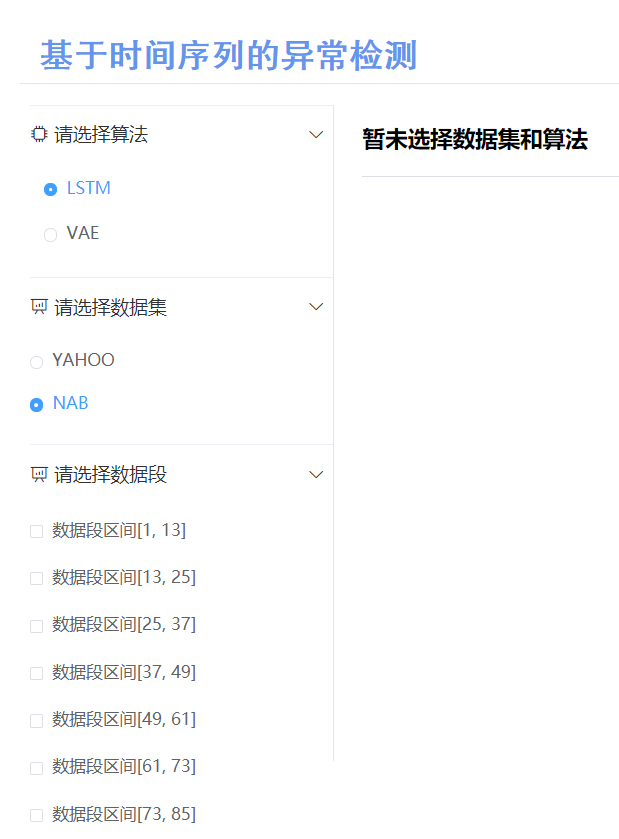
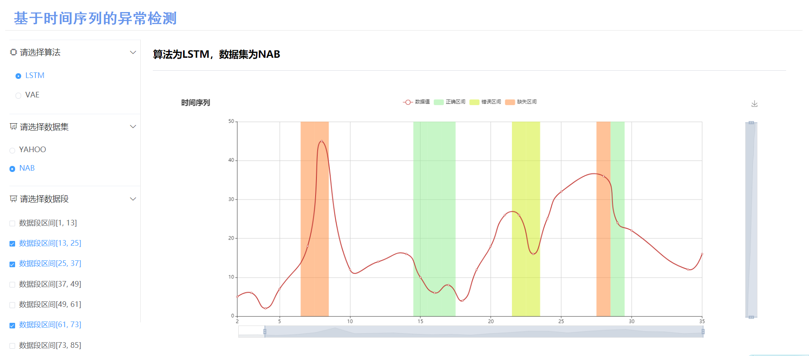

# 第六周工作

### 1. 修改与优化前端页面的设计

本周在上一周工作的基础上继续优化了前端页面，添加了选择数据段的功能与可视化数据的显示，如下图所示：



然后增加了数据的传输与获取功能，总共设置了以下几个Url前后端接口：

```python
urlpatterns = [
    url('admin/', admin.site.urls),
    url(r'index/$', views.index),
    url(r'getdata$', views.get_data),
    url(r'getwindows$', views.get_windows)
]
```

### 2. 使用Echarts图表实现数据可视化

为了使得数据与结果显示的更加直观，使用Echarts工具来进行数据可视化，最终完成的静态页面效果如下：

