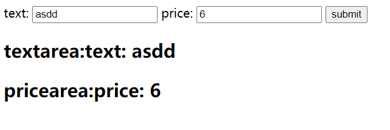
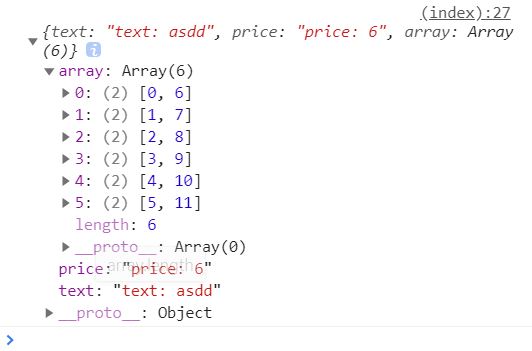
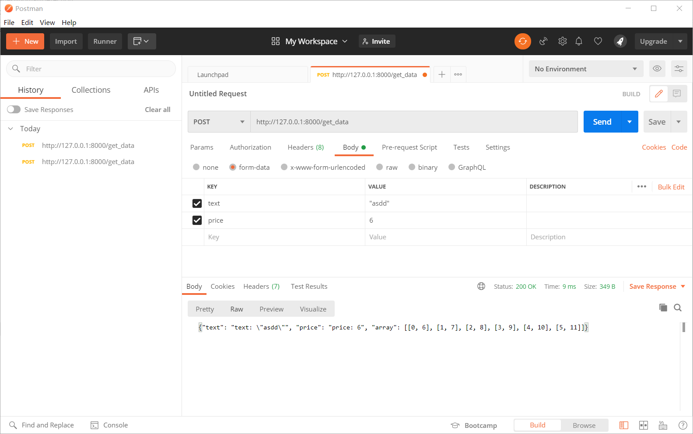

# 第九周工作

### 1. 回顾与总结前几周的前端开发工作

我在本周对5~8周的前端开发工作进行了总结，并将进度与工作在Github上进行了更新。

### 2. 本项目中的前后端接口统计

结合第一部分对项目前端开发过程的Review，统计了项目中所需要使用的前后端接口，如下表所示：

|     URL      | 接口功能 | 请求方式 | 前端发送的数据内容                                      | 前端接收的数据内容                                           |
| :----------: | :------: | :------: | ------------------------------------------------------- | ------------------------------------------------------------ |
|   /index/    | 网页页面 |   GET    | <WSGIRequest: GET '/index/'>                            | render(request, “index.html”， {})                           |
| /get_windows | 获取窗口 |   POST   | model_sel: 模型名称: string                             | data_size: 数据规模: int window_size: 窗口大小: int max_selected：窗口最大数目: int  |
|  /get_data   | 获取数据 |   POST   | algorithm: 模型名称: string windows: 数据段: int[] | data_set: 原始数据集: int\[][2] original_anomaly: 原始异常点: int[] anomaly_score: 异常分数: int\[][2] res_value: 检测结果: string |

### 3. 学习与探索Postman的使用

本周学习与探索了Postman的使用，为了便于学习与排错，使用了一个简单demo来进行接口测试，该demo也是采用Django框架来搭建，只是传输数据的逻辑较为简单，该Demo的页面截图如下：

其主要逻辑是输入内容并提交，则后端获取前端的数据后将其处理并传送回前端，然后前端将其显示在页面上，传递过程使用Ajax技术，请求方式为POST（与实际项目一样），这个过程中前端接收回的数据为：

上面的现象说明使用前端界面访问服务器时数据传输是正常的，现在使用Postman来对指定URL进行请求并传入相同的参数，即假定在没有前端界面的情况下进行请求，结果如下图所示：

可以发现在下方出现了和网页控制台中一样的结果，即我们正确使用Postman完成了对接口的测试。

