# Front-end using manual

### 1. Front-end file structure

Project group uses Django 3.1.3 based on Python 3 to build the basic architecture of the front-end part. And  some frameworks such as Vue, Element UI and jQuery are used to optimize and assist the design of page style and logic of the front-end page. In this project, we do not use the pattern where front-end and back-end are completely separated, and the back-end codes are surrounded with the front-end part. File structure of the project is shown as below.

```
TimeseriesAnomalyDetection
│  db.sqlite3 (database file, not used in the project)
│  manage.py (entrance of the project)
│
├─static (global static images and library files used in the projet)
│  ├─img
│  ├─jquery
│  └─vuejs
│      └─fonts
│
├─templates (page files of the project, format .html)
│      index.html
│
├─TimeseriesAnomalyDetection (back-end files, format .py)
│  │  asgi.py (entrance of web server compatible with ASGI)
│  │  settings.py (project configuration file)
│  │  urls.py (define all urls and paths of the project)
│  │  views.py (define functions of the urls defined in the 'urls.py')
│  │  wsgi.py (entrance of web server compatible with WSGI)
│  │  __init__.py (constructor of 'TimeseriesAnomalyDetection' class)
│  │
│  ├─RNN (model files)
│  │
│  └─TSI_CNN (model files)
│
└─venv (enviroment files)
```

We could input the command below in the root directory to start the project.

```shell
python manage.py runserver 8000
```

And then we enter the following URL into the address bar in your browser to access the page.

```
http://127.0.0.1:8000/index/
```

Then we can see the following page which indicates that we’ve run the project successfully.

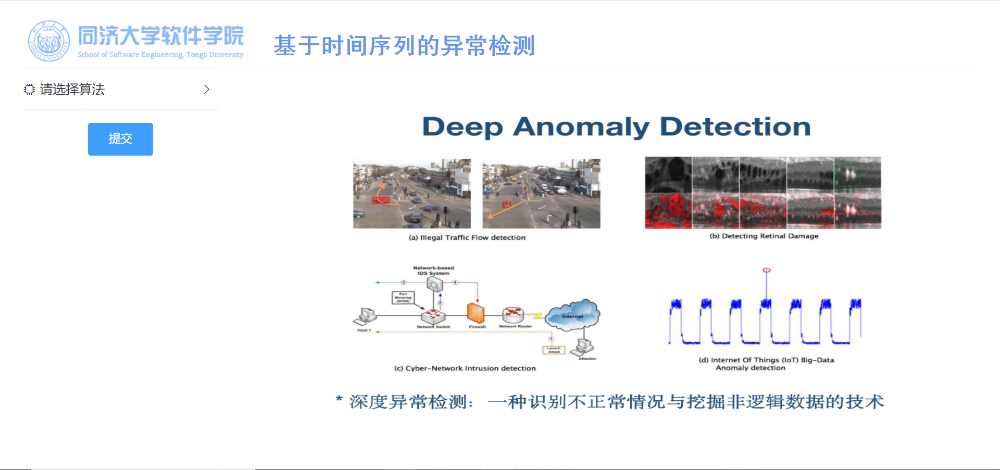

### 2. Front-end content model

As for the main layout the page, we use the following layout pattern provided by Element UI. In part named “Header”, we display the basic information of our project. In “Aside” part we provide some operations for users and in the “Main” part we display the introduction of the technology used in the project and the result of the detection.

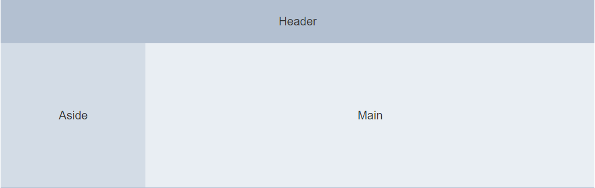

And the final data tree diagram of the content model is shown as follow.

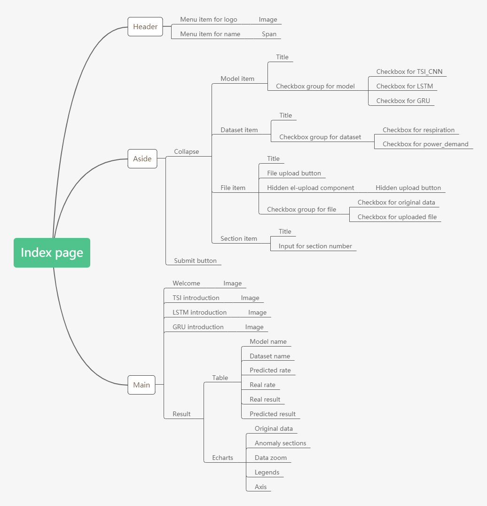

### 3. Front-end interaction model

Based on design of the content model and data tree diagram, we design the interaction logic between the user and the page which is described with activity diagram as follow.

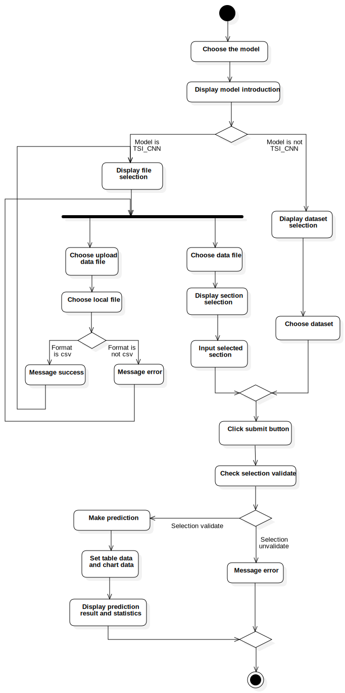

### 4. Front-end function model

According to the content model and the interaction model designed above, we design and implement the following functions contributing to better introducing and displaying the project.

*   When the user opens the page, there will be a welcome page shown to briefly introduce the main background and the main technology of the project.

    

*   When the user chooses to select the algorithm, the checkboxes will display. And when the user selects one algorithm, the main area will display the brief introduction to the corresponding model.

    *   If the user selects model named ‘TSI_CNN’, file selection form will appear in the aside area. There will show default data file and files which have been uploaded.

        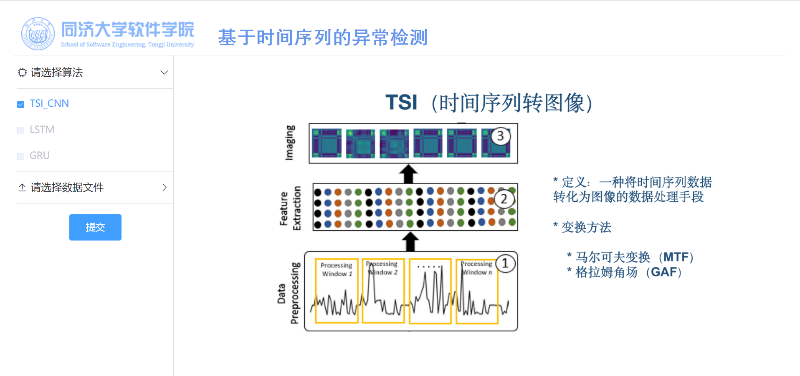

        *   If the user clicks the upload button, there will be a dialog for the user to choose the file. After the user chooses the file, validation of the selection will be judged.

            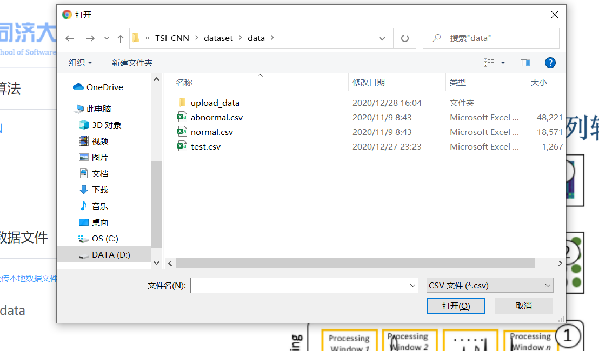

            *   If the filename is ended with “.csv”, the selection will be validate. And there will be a success message shown. Then the file list will be reloaded.

                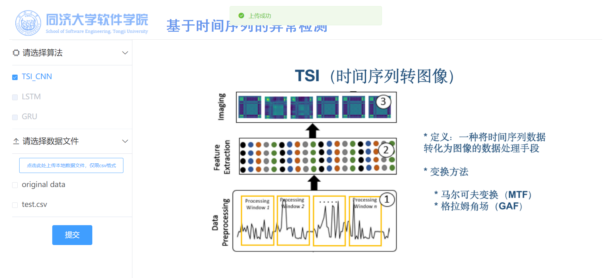

            *   If not, the selection will be invalidate. There will also be an error message shown.

                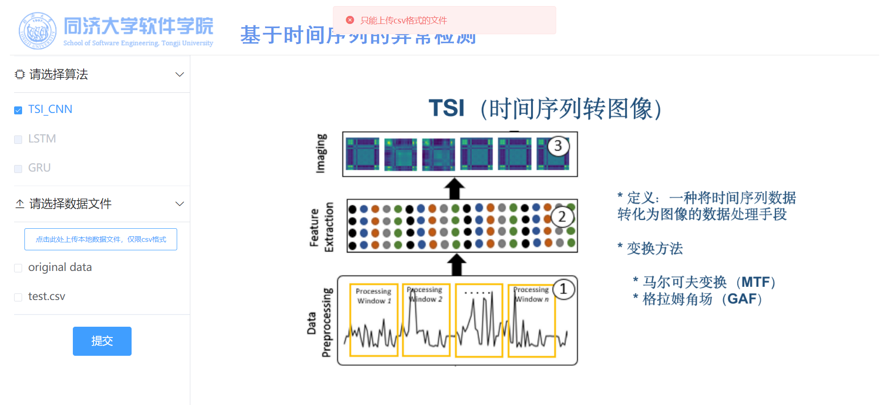

        *   When the user selects the data file, the system will read and analyse the file and figure out how many sections there are in the file and the section selection form will appear in the aside area.

            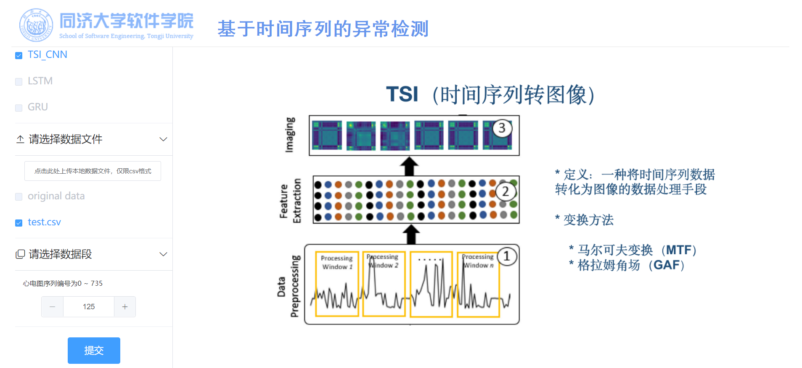

    *   If the user selects other models, dataset selection form will appear in the aside area.

        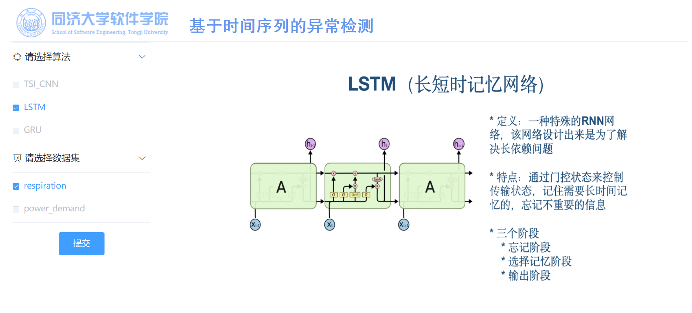

*    When the user clicks the submit button, the system will check whether the user has selected model and dataset, or model, file and section. 

    *   If there is something missing, there will be an error message shown.

        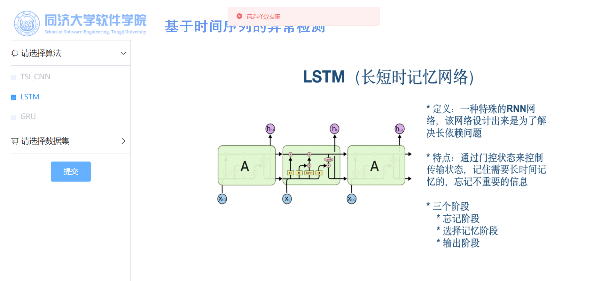

    *   If not, the message including all selection will send to the back-end part. And after receiving the response, the system will show the statistics as table and show the data and result as chart. 

        *   If the model selected is named “TSI_CNN”, the table data will include model name, dataset name, predicted success rate, real success rate, real result and predicted result and the chart data will include original data only.

            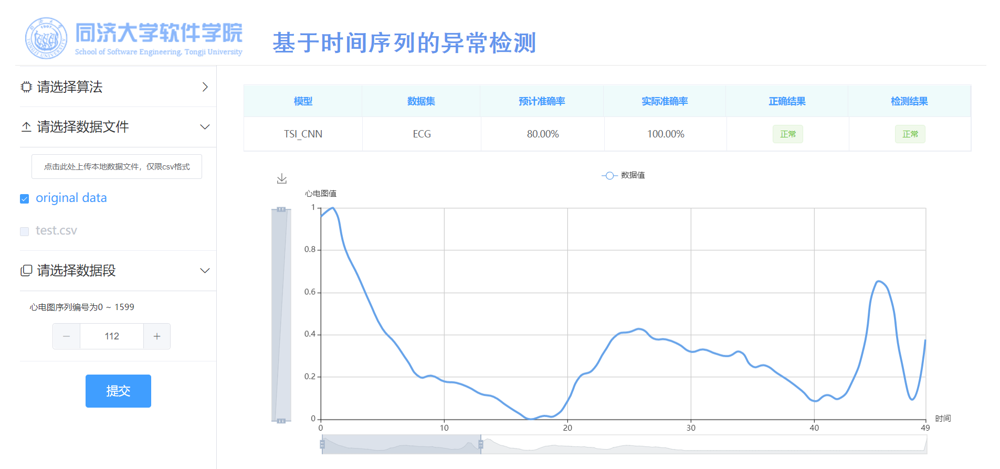

        *   If not, the table data will include model name, dataset name, predicted AUC value, real AUC value and the chart data will include original data, original anomaly ranks, predicted normal sections and predicted anomaly sections.

            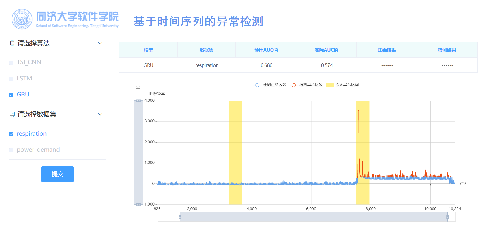

*   If wanting to make another prediction, the user will have to wait until current prediction finishes. If not, when the submit button is clicked, there will be an error message shown to inform that.

    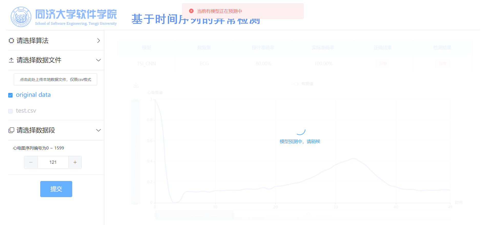