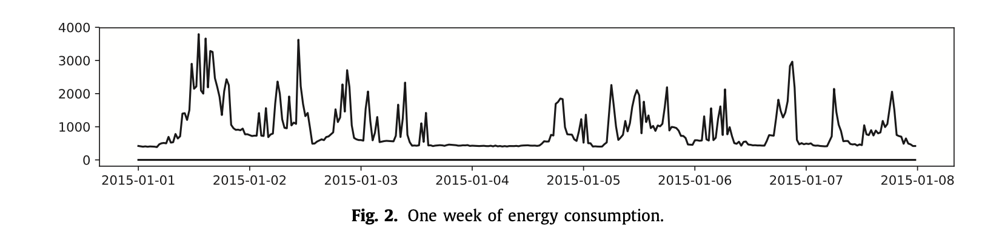
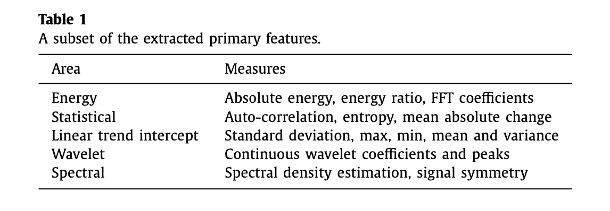
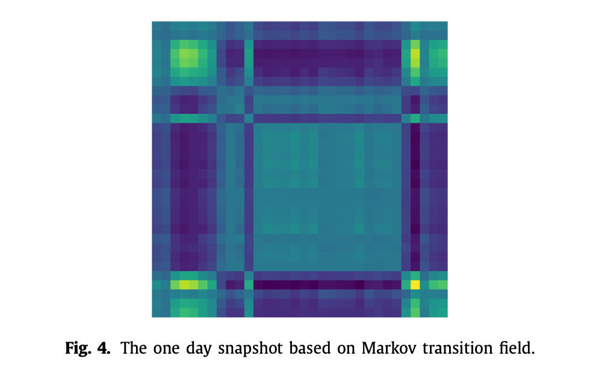
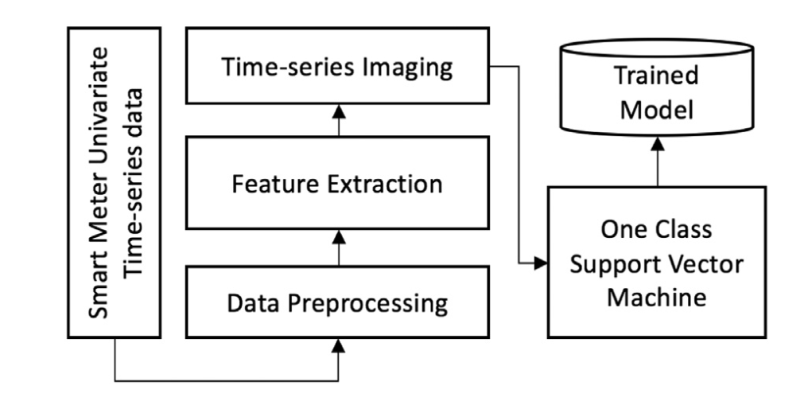

## TSI-Model

### 1. Method summary

1. Use the TSI model to automatically extract multiple elements from univariate time series data

2. Use MTF to encode them as 2D images
   1. One dimension represents the transition probability of Kirkov
   2. Another dimension reflects time dependence

3. Then use a level of support vector machine for classification, the benefits are as follows:
   1. It does not require abnormal data

   2. It can distinguish between normal energy consumption patterns and all other possible complex abnormalities. Therefore, in the prediction phase, it can identify normal and abnormal patterns in daily energy consumption

### 2. Details

#### 2.1 Data preprocessing

Smart metering data is stored in log files as a time series (ie, time stamp, energy consumption value). The sampling period of this series is about 8 seconds, and a 30-minute non-overlapping window is defined to segment continuous time series data. The figure below provides one-week energy consumption data segmented by 30-minute windows, and the average value is kept for further processing. It can be seen that the identification of abnormal energy consumption is not a straightforward process. For example, it is impossible to set a threshold to classify segmented windows as normal or abnormal, so some meaningful features need to be extracted.

#### 2.2 Feature extraction

At this stage, a method based on scalable hypothesis testing (also known as TSFRESH) was used to automatically extract features using time-series feature extraction libraries. It speeds up this process by combining 63 time series features. These methods calculate a total of 794 descriptive time series features, from simple mean to power spectral density. The main functions extracted are as follows. This library is very effective when applied to the distributed and parallel processing of data streams.

#### 2.3 Markov transform into image

The idea is to maintain the interactive relationship between function and compact information through the transition probability of Kirkov. It is achieved by the following steps：

1. The first step is to quantify the feature space through symbol aggregation approximation and calculation bins

2. The second step is to calculate the Kirkov transition matrix, and treat the quantized element space as the Kirkov chain

3. Finally, calculate the transition field from the transition matrix

Compared with the direct storage of logs and the automatic retrieval function, this method can reduce storage costs. After the feature space is coded through the imaging process, a snapshot of the feature space with temporal information is obtained. The single image is shown below

#### 2.4 Use OCSVM for classification

In the proposed model, classifying energy consumption as normal or abnormal is based on OCSVM. OCSVM is a supervised learning model that can learn from the information of normal sample values. It converts energy consumption data into a high-dimensional feature space through a kernel function. Then iteratively find the largest margin super flat, which uses relaxation parameters to separate the training data from the origin. The origin of the super flat surface is regarded as an abnormal data point. It has the ability to build boundaries around daily energy consumption. During the testing phase, any instance that exceeds the defined boundary is considered an abnormal pattern, because the abnormal points deviate in number from the normal observed value of energy consumption. Therefore, the target function tries to distinguish the origin from all positive observations as far as possible. At this stage, the model is trained to understand normal energy consumption patterns. The figure below is the training process of the model.

Preprocess univariate time series data, and save the model after training on energy consumption patterns. In the training phase, because there is only a normal energy consumption mode, the data is divided into 70% and 30% for training and verification. During OCSVM training, we choose a linear kernel that requires a parameter v, whose value should be an interval of (0, 1). In our training process, it is set to 0.1. This corresponds to the upper limit of the training error score and the Support the lower limit of the vector score. We obtain the value of v from experiments, which may be different in different problems, and is used to classify normal and abnormal energy consumption patterns during the test phase.
