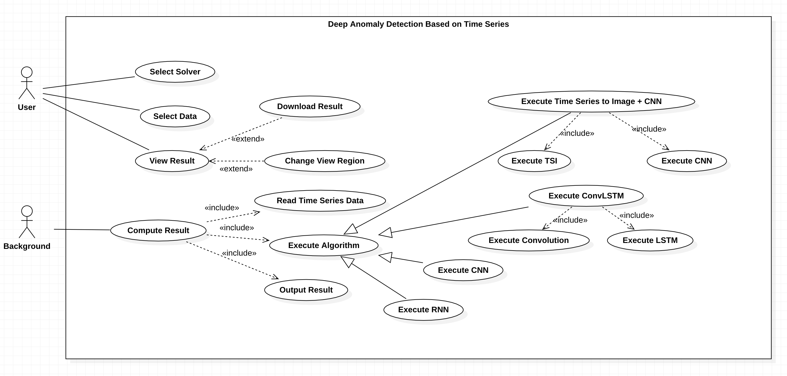

# Requirements Specification Document

[toc]

## Project scope

### Background

This project focuses on the research and program development of DAD（Deep Anamoly Detection）drawing on expertise from School of Software Engineering.

DAD firstly uses some transforms to modify the original time series data , then uses Deep learning to classcify the normal and abnormal points. 

A common need when analyzing real-world data-sets is determining which instances stand out as being dissimilar to all others. Such instances are known as *anomalies*, and the goal of *anomaly detection* (also known as *outlier* *detection*) is to determine all such instances in a data-driven fashion (Chandola et al. [2007]). Anomalies can be caused by errors in the data but sometimes are indicative of a new, previously unknown, underlying process; Hawkins [1980] defines an outlier as an observation that *deviates so signifificantly from other observations as to arouse suspicion* *that it was generated by a different mechanism.* In the broader field of machine learning, the recent years have witnessed a proliferation of deep neural networks, with unprecedented results across various application domains. Deep learning is a subset of machine learning that achieves good performance and flexibility by learning to represent the data as a nested hierarchy of concepts within layers of the neural network. Deep learning outperforms the traditional machine learning as the scale of data increases. In recent years, deep learning-based anomaly detection algorithms have become increasingly popular and have been applied for a diverse set of tasks; studies have shown that deep learning completely surpasses traditional methods (Javaid et al. [2016], Peng and Marculescu [2015]). The aim of this survey is two-fold, firstly we present a structured and comprehensive review of research methods in deep anomaly detection (DAD). Furthermore, we also discuss the adoption of DAD methods across various application domains and assess their effectiveness.

### Purpose

The purpose of this project is to study and investigate the method of DAD, for example TSI+CNN, RNN, LSTM, etc. Based on above study and survey, it is expected to provide a program with simple, user-friendly front-end display page for anomaly detection based on time series data, which can read the file uploaded by users and support users to select specific models for anomaly detection.

The goal of this project is to apply and practice software engineering methods and ideas during the scientific research process, from requirement analysis to modeling, to architecture design and detailed design, to the final code implementation and review at each stage. Throughout the project cycle, we always adopt the agile development model, hold weekly meetings, report on the work progress of the previous week, discuss solutions to problems encountered in the previous stage, and plan and assign tasks for the next week. At the same time, in order to make the whole project clear, we learned and tried many process management tools and project management tools, such as Microsoft Todo, github, postman, curtain, etc.

### Target Users

The target users of this program are health care providers who monitor medical and health care. After the product is finally delivered, the user can also be teachers and students who need to learn and research on time series data anomaly detection.

### Our Works

* Read related review papers and research papers, and learn the knowledge and methods of DAD.
* Sort out the content of related papers, extract and organize key content.
* Collect the implementation code of related papers, improve and train the model.
* Sorted out some time series data sets related to the research field of the project, such as smart meter data with time stamps.
* Design and implement a humanized front-end, allowing users to upload time series data files and select specific models for outlier detection.
* Write related documents, such as model training manuals, user manuals, etc.

## Use Case Analysis

| **Use Case 1: Select Solver**                                |
| ------------------------------------------------------------ |
| **ID:** UC1                                                  |
| **Actor:** User                                              |
| **Description:** This use case allows users to select the DAD solver. |
| **Pre-condition:** The user has entered the website.         |
| **Flow of Events:**  1. The user click the DAD solver he/she wants to choose. |
| **Post-condition:** The website show the datasets which can be solved by this solver. |

| **Use case 2: Select Data**                                  |
| ------------------------------------------------------------ |
| **ID:** UC2                                                  |
| **Actor:** User                                              |
| **Description:** Select an dataset presented by the website. |
| **Pre-condition:** Solver has been selected.                 |
| **Flow of Events:** View the folders presented by the systemChoose a matrix file, it is the matrix to be solved. |
| **Post-condition:** The dataset is selected.                 |

| **Use Case 3: View Results**                                 |
| ------------------------------------------------------------ |
| **ID:** UC3                                                  |
| **Actor:** User                                              |
| **Description:** This use case allows the user to view system-generated analysis results, including a line chart showing raw time series data and predictions, as well as a demonstration of the model's expected and actual accuracy. |
| **Pre-condition:** The background program has computed the results of the selected algorithms, and the corresponding data has been delivered to the front-end webpage. |
| **Flow of Events:**  1. The web page contains predictive data and statistics automatically generated by the backgrounder, including a judgment of whether the current time series data is abnormal and the current prediction accuracy. 2. The webpage generates a line chart and a bar chart to display the predictive data and statistics as mentioned above. 3. The users can view the two charts at the right side of the website as soon as the calculation results come out. |

| **Use Case 4: Compute Results**                              |
| ------------------------------------------------------------ |
| **ID:** UC4                                                  |
| **Actor:** Background Program                                |
| **Description:** This use case describes the calculation process of the anomaly detection algorithm, including reading data, using models to make predictions, and returning predictions. |
| **Pre-condition:** The user has selected the model and dataset. |
| **Flow of Events:** 1. Get the solver model selected to be executed. 2. Include(Read Time Series Data) 3. Include(Execute Algorithm) 4. Include(Output Results) 5. Get the result. |
| **Post-condition:** The result data(judgement of whether if it's anomaly point) will be delivered to the front-end. |

| **Use Case 5: Download Results**                             |
| ------------------------------------------------------------ |
| **ID:** UC5                                                  |
| **Actor:** Users                                             |
| **Description:** This use case allows the user to download calculated anomaly detection results and accuracy statistics. |
| **Pre-condition:** The result has been calculated and shown in the screen. |
| **Flow of Events:** 1. The user clicks the download buttonThe user clicks 2. Start downloading |
| **Post-condition:** The test results and accuracy statistics are downloaded locally as a file. |

| Use Case 6: Change View Region                               |
| ------------------------------------------------------------ |
| **ID:** UC6                                                  |
| **Actor:** Users                                             |
| **Description:** This use case allows the user to scale the size of the line chart that shows the test results. |
| **Pre-condition:** The result has been calculated and shown in the screen. |
| **Flow of Events:** 1. The user presses and drags the scale bar. 2. Front-end program change the region. |
| **Post-condition:** The line chart display area is zoomed in and out as the scale changes. |

| Use Case 7: Read Time Series Data                            |
| ------------------------------------------------------------ |
| **ID:** UC7                                                  |
| **Actor:** Background Program                                |
| **Description:** This use case describes the operation of a back-end program to read a time series dataset file selected by the user. |
| **Pre-condition:** The user has selected the model and dataset. |
| **Flow of Events:** 1. Get the name of the dataset. 2. Read the data. |
| **Post-condition:** The time series data is already.         |

| Use Case 8: Execute Algorithm                                |
| ------------------------------------------------------------ |
| **ID:** UC8                                                  |
| **Actor:** Background Program                                |
| **Description:** This use case describes the calculation process of the anomaly detection algorithm, including reading data, using models to make predictions, and returning predictions. |
| **Pre-condition:** The user has selected the model and dataset. |
| **Flow of Events:** 1. Read the certain model selected by user, 2. Detect the selected data. 3. Return the result. |
| **Post-condition:** The result  is send to front-end in specific formats. |

| Use Case 9: Output Result                                    |
| ------------------------------------------------------------ |
| **ID:** UC9                                                  |
| **Actor:** Background Program                                |
| **Description:** This use case shows how web gain the results. |
| **Pre-condition:** The algorithm programs on the server have finished the iterations. |
| **Flow of Events:** 1. The front-end program request the result from back-end program. 2. The web show the detection result and the statistical result. |