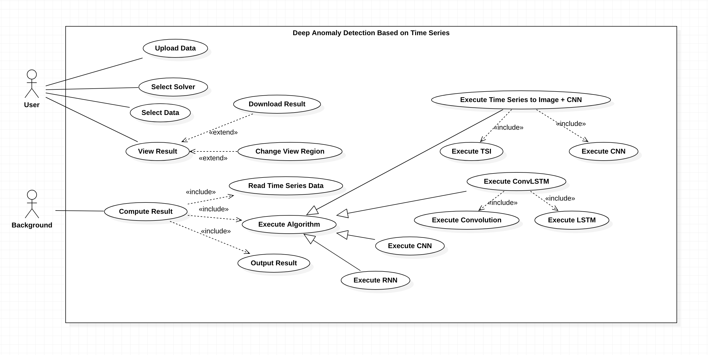

# Requirements Specification Document

## Project scope

### Background

This project focuses on the research and program development of DAD（Deep Anamoly Detection）drawing on expertise from School of Software Engineering.

DAD firstly uses some transforms to modify the original time series data , then uses Deep learning to classcify the normal and abnormal points. 

A common need when analyzing real-world data-sets is determining which instances stand out as being dissimilar to all others. Such instances are known as *anomalies*, and the goal of *anomaly detection* (also known as *outlier* *detection*) is to determine all such instances in a data-driven fashion (Chandola et al. [2007]). Anomalies can be caused by errors in the data but sometimes are indicative of a new, previously unknown, underlying process; Hawkins [1980] defines an outlier as an observation that *deviates so signifificantly from other observations as to arouse suspicion* *that it was generated by a different mechanism.* In the broader field of machine learning, the recent years have witnessed a proliferation of deep neural networks, with unprecedented results across various application domains. Deep learning is a subset of machine learning that achieves good performance and flexibility by learning to represent the data as a nested hierarchy of concepts within layers of the neural network. Deep learning outperforms the traditional machine learning as the scale of data increases. In recent years, deep learning-based anomaly detection algorithms have become increasingly popular and have been applied for a diverse set of tasks; studies have shown that deep learning completely surpasses traditional methods (Javaid et al. [2016], Peng and Marculescu [2015]). The aim of this survey is two-fold, firstly we present a structured and comprehensive review of research methods in deep anomaly detection (DAD). Furthermore, we also discuss the adoption of DAD methods across various application domains and assess their effectiveness.

### Purpose

The purpose of this project is to study and investigate the method of DAD, for example TSI+CNN, RNN, LSTM, etc. Based on above study and survey, it is expected to provide a program with simple, user-friendly interface for anomaly detection based on time series data.

### Target Users

### Boundary of the Project

## Use Case Analysis

