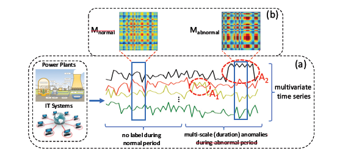
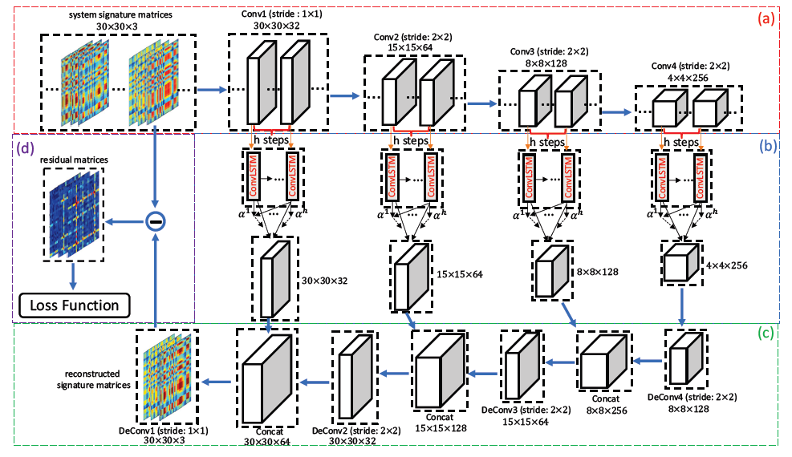
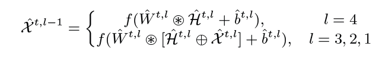
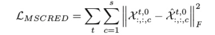
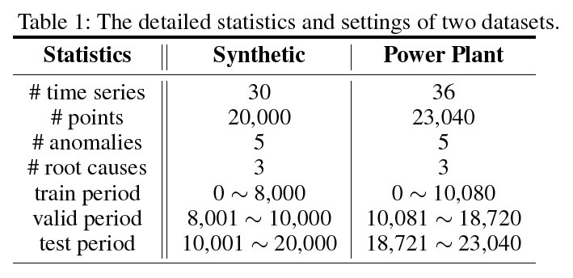
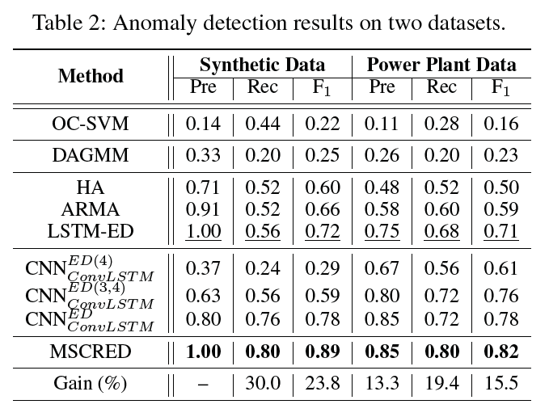
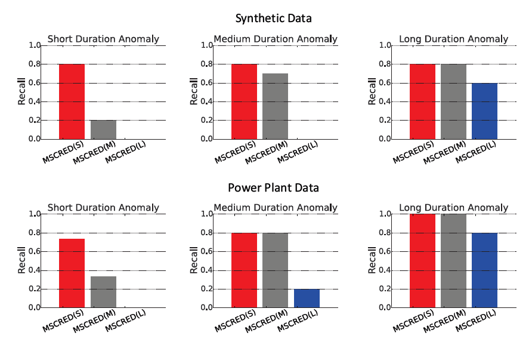
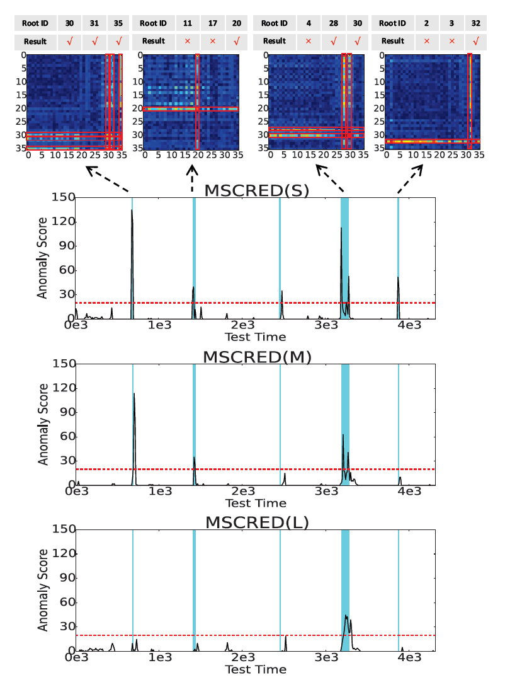

# A Deep Neural Network for Unsupervised Anomaly Detection and Diagnosis in Multivariate Time Series Data

> 论文名：多变量时间序列数据中无监督异常检测与诊断的深度神经网络
>
> 来源：The Thirty-Third AAAI Conference on Artificial Intelligence (AAAI-19)
>
> 发表年份：2019年
>

---

[toc]

## 1. 概述

* 论文首先提出了大多数检测系统无法有效检测异常的三个原因
  1. **多变量时间序列数据存在时间依赖性**，距离/聚类方法如高斯混合模型可能因为这个问题而表现一般，因为不能捕获在不同的时间步长中的时间依赖关系
  2. **多变量时间序列数据在实际应用中通常含有噪声**，当噪声变得比较严重时，可能会影响时间预测模型的泛化能力
  3. 在现实应用中，根据不同事件的严重程度，需要为操作人员提供不同级别的**异常评分**，现有的根本原因分析方法，如因果异常排序(RCA)等，对噪声敏感，无法解决这一问题

* 本论文提出了一种==多尺度卷积循环编解码器(MSCRED)==，用于多变量时间序列数据的异常检测和诊断，共同考虑解决上述的三个问题。

MSCRED具体的工作流程为：

1. 首先构造多尺度(分辨率)**签名矩阵**来描述不同时间步长的系统状态的多个级别。特别的是，使用不同级别的系统statuses来表示不同异常事件的严重程度
2. 在给定信号矩阵的基础上，采用**卷积编码器**对传感器间(时间序列)关联模式进行编码，并开发了**基于注意力(attention based)的卷积长-短期记忆(ConvLSTM)**网络来捕获时间模式
3. 利用编码传感器间相关性和时间信息的特征图，并利用**卷积译码器**重构特征矩阵，最后利用残差特征矩阵对异常进行检测和诊断

## 2. 主体内容介绍

### 问题阐述

已知n个长度为T的时间序列的历史数据，即， X = (x1，··，xn)^T，T∈Rn×T，假设数据中不存在异常，我们的目标是实现两个目标:

* 异常检测，即检测T后特定时间步长的异常事件。
* 异常诊断，即根据检测结果，识别最可能导致每个异常的异常时间序列，并定性地解释异常的严重程度(持续时间尺度)

### 用签名矩阵（signature matrice）描述状态

为了表示从$$t - w$$到$$t$$的多元时间序列段中不同对时间序列之间的相互关系，论文基于该段内两个时间序列的两两内积构造一个$$n×n$$签名矩阵$$M^t$$。

假设输入的两个时间序列为$$x_i^w=(x_i^{t-w},x_i^{t-w-1},...,x_i^t)$$，$$x_j^w=(x_j^{t-w},x_j^{t-w-1},...,x_j^t)$$，则$$M^t$$的计算式为
$$
m_{ij}^t=\frac{\Sigma_{a}^{w}x_i^{t-a}x_j^{t-a}}{w}
$$
$$M^t$$不仅可以捕捉到两个时间序列之间的形状相似性和值尺度相关性，而且对输入噪声具有鲁棒性，因为特定时间序列的湍流对特征矩阵的影响不大。

### 卷积编码器

使用一个全卷积编码器对系统签名矩阵的空间模式进行编码，在不同的尺度上将$$M^t$$连接为一个张量$$X^{t,0}$$，然后将其提供给许多卷积层。
$$
X^{t,l}=f(W^l*X^{t,l-1}+b^l)
$$
其中$$W^l$$是卷积核，$$b^l$$是偏置项，$$f()$$为激活函数。

形成签名矩阵所基于的时间序列的确切顺序并不重要，因为对于任何给定的置换，产生的局部模式都可以被卷积编码器捕获。

### ConvLSTM

ConvLSTM被开发用于捕获视频序列中的时间信息，但其性能可能会随着序列长度的增加而恶化。论文开发了一个基于注意力的ConvLSTM（attention based ConvLSTM），它可以跨不同的时间步自适应地选择相关的隐藏状态(特征图)。

简单来说，给定l-th卷积层的特征映射$$X^{t,l}$$和之前的隐藏状态$$H^{t-1,l}$$，可以将当前隐藏状态$$H^{t,l}$$更新为
$$
H^{t,l}=ConvLSTM(X^{t,l},H^{t-1,l})
$$
工作中，在每一层保持与卷积编码器相同的卷积内核大小，与LSTM不同，所有的输入、输出、隐态都是三维张量，通过测试步长为5时表现最佳。此外，考虑到并不是所有前面的步骤都与当前状态相关，我们采用暂时性的注意机制，自适应地选择当前步骤相关的步骤和聚合信息的表示特性映射，来形成一个完善的输出特性。

本质上，基于注意力的ConvLSTM在每个卷积层联合建模带有时间信息的签名矩阵的空间模式。

### 卷积译码器

为了对上一步得到的特征映射进行解码，得到重构的签名矩阵，论文中设计了一个卷积解码器，公式如下。

该解码器能够融合不同反卷积层和对流层的特征图，有效地改善异常。

### 损失函数

对于MSCRED，经过足够多的训练时间后，利用学习到的神经网络参数来推导验证数据和测试数据的重构签名矩阵，将其与原签名矩阵进行比较构建残差特征矩阵进行异常检测和诊断。

## 3. 论文实验分析

### 数据集

论文中实验使用一个合成数据集和一个真实世界的电厂数据集进行实证研究。

### 实验内容

本论文使用**Tensorflow**实现MSCRED。实验将MSCRED与四类八种基线方法进行比较，分别是**分类模型**、**密度估计模型**、**预测模型**和**MSCRED变体**，其中：

* OC-SVM（分类模型）
* DAGMM 深度自动编码高斯混合模型 （密度估计）
* ARMA 自回归滑动平均模型（预测模型 *非机器学习*）
* LSTM-ED 长短期记忆模型
* MSCRED变体：移除ConvLSTM层数及基于注意力的模型。

实验使用精度Precision、Recall、F1三个度量标准来评估每种方法的异常检测性能，结果如下图。

### 异常检测结果（与其他模型比较）

* 时间预测模型优于分类和密度估计模型，说明两个数据集都具有时间依赖性
* 深度学习模型比传统方法能够捕捉到更复杂的数据关系
* MSCRED在所有标准上表现最佳

### 异常检测结果（与模型变体比较）

* ConvLSTM层和堆叠译码过程对模型细化的有效性
* 基于注意力的ConvLSTM可以进一步提高异常检测性能

为了进一步证明注意模块的有效性，上图给出了最后两层ConvLSTM中注意权重在前5个时间步长的平均分布。较早的时间(step1,2)通常处于正常状态，分配的attention weight低于正常段的分布，而当系统在之后的时间步中处于不同的状态时则attention weight的权重会上升。即attention模块对系统状态变化具有较高的敏感性，有利于异常检测。

### 根本原因识别

论文中主要对比了MSCRED和LSTM-ED的性能，

* 对于LSTM-ED，使用每个时间序列的预测误差来表示该序列的异常分数
* 对于MSCRED，使用残差签名矩阵某一特定行/列中不良重建的两两相关性的数量，因为每一行/列代表一个时间序列。对于每个异常事件，将所有时间序列按其异常得分进行排序，并确定top-k序列为根本原因。

结果显示，MSCRED的表现比LSTMED高出约25.9%。

### 异常严重程度（持续时间）解释

实验中MSCRED的签名矩阵有三个通道，可以在不同尺度上捕捉系统状态，根据三个通道的残差特征矩阵计算不同的异常分数，分别表示为MSCRED(S)、MSCRED(M)、MS- CRED(L)，相应的分段大小为10，30，60。

可以观察到MSCRED(S)可以检测所有类型的异常，MSCRED(M)可以检测中长期异常，MSCRED(L)只能检测长时间异常。因此，论文中联合考虑三个异常值来解释异常的严重程度。如果能在所有三个通道中检测到异常，那么异常持续时间很可能很长。否则，它可能是一个短期或中期持续异常。

### 噪声的鲁棒性

论文在不同的合成数据集上进行实验，在上式中加入各种噪声因子的组合。可以观察到MSCRED在0.2 - 0.45的噪声范围内始终优于ARMA和LSTM-ED，表明MSCRED对输入噪声具有更强的鲁棒性。

