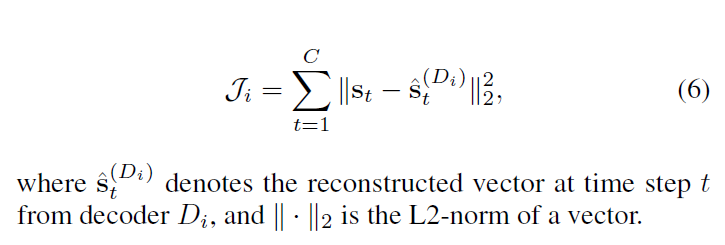

# Outlier Detection for Time Series with Recurrent Auto-encoder Ensembles

### 1. Introduction

The paper proposes two solutions to outlier detection in time series based on recurrent autoencoder ensembles. The two solutions are ensemble frameworks, specifically an independent framework and a shared framework, both of which combine multiple S-RNN based autoencoders to enable outlier detection. This ensemble-based approach aims to reduce the effects of some autoencoders being overfitted to outliers, this way improving overall detection quality.

### 2. Theoretical Foundation

##### 2.1 Autoencoder Ensembles

Autoencoder ensembles aim to further improve the accuracy of outlier detection based on autoencoders. The main idea is to build a set of autoencoders and to consider the reconstruction errors from multiple autoencoders when detecting outliers. Using a set of classic, fully-connected autoencoders is not helpful. So instead, for each autoencoder, it is helpful to randomly remove some connections to obtain a sparsely-connected autoencoder. Then, an autoencoder ensemble consists of multiple sparsely-connected autoencoders with different network structures, which helps reduce the variances of the overall reconstruction errors.

However, autoencoder ensembles are only available for non-sequential data, and these cannot be applied directly to sequential data such as time series. Therefore, it is necessary to modify the autoencoder ensembles and make it available for sequential data.

##### 2.2 Autoencoder Ensembles For Time Series

###### 2.2.1 Independent Framework (IF)

The following figure shows the basic, independent framework of an S-RNN autoencoder ensemble. The ensemble contains N S-RNN autoencoders that each consists of an encoder E~i~ and a decoder D~i~, 1 ≤ i ≤ N. Further, each autoencoder has its distinct sparseness weight vectors.

Each autoencoder in the ensemble is trained independently by minimizing the objective function Ji that measures the difference between the input vectors in the original time series and the reconstructed vectors.

###### 2.2.2 Shared Framework (SF)

The independent framework trains different autoencoders independently, meaning that different autoencoders do not interact during the training phase. However, since all autoencoders try to reconstruct the same, original time series, it is relevant to enable interactions among the autoencoders. So there is a shared framework which incorporates interactions among different autoencoders proposed in the paper. In the framework, given N tasks where each task reconstructs the original time series, and the N tasks are designed to interact through a shared layer. The structure of the shared framework is shown in the following figure.

The shared layer **h**~C~^(E)^ uses linear weight matrices  **W**^(E)^ to concatenate the linear combinations of all the last hidden states of all the encoders.

Each decoder D~i~ employs the concatenated hidden states **h**~C~^(E)^ as the initial hidden state when reconstructing time series. In the shared framework, all autoencoders are trained jointly by minimizing the objective function J that sums up the reconstruction errors of all autoencoders and an L1 regularization term on the shared hidden state.

In the formula above, λ is a weight that controls the importance of the L1 regularization  ||**h**~C~^(E)^||~1~. The L1 regularization has the effect of making the shared hidden state **h**~C~^(E)^ sparse. This avoids cases where some encoders overfit to the original time series and helps make the decoders robust and less affected by outliers. Hence, when autoencoders meet outliers, the difference between original time series and reconstructed time series is more pronounced.

### 3. Relevant Experiment

##### 3.1 Experimental Data Sets

There are two real-world time series repositories used in the experiment. For both repositories, ground truth labels of outlier observations are available. However, consistent with the unsupervised setting, these labels are not used for training but for evaluating accuracy.

###### 3.1.1 Numenta Anomaly Benchmark (NAB)

NAB, an univariate repository, comprises six sets of time series from different domains, where each set has around 10 univariate time series and each time series contains from 5,000 to 20,000 observations.

###### 3.1.2 Electrocardiography (ECG)

ECG, a multivariate repository, comprises seven 3-dimensional time series from seven patients, where each time series has 3,750 to 5,400 observations.

##### 3.2 Experimental Content

###### 3.2.1 Existing Solutions

In the experiment, the proposed independent and shared ensemble frameworks (IF and SF) are compared with seven competing solutions:

*   Local Outlier Factor (LOF), a well-known density-based outlier detection method
*   One-class Support Vector Machines (SVM), a kernel-based method
*   Isolation Forest (ISF), a randomized clustering forest
*   Matrix Profile I (MP), a state-of-the-art similarity-based outlier detection method
*   Rand-Net (RN), a method using the state-of-the-art feedforward autoencoder ensembles for non-sequential data
*   Convolutional Neural Networks based Autoencoder (CNN), a method treating time series as images and employ a CNN autoencoder to reconstruct the image
*   Long Short-Term Memory Neural Networks based Autoencoder(LSTM), a state-of-the-art deep learning outlier detection method for time series

###### 3.2.2 Evaluation Metrics

Following the evaluation metrics used for evaluating autoencoder ensembles on non-sequential data, two metrics that consider all possible thresholds are employed in the experiment. The two metrics are Area Under the Curve of Precision-Recall (PR-AUC) and Area Under the Curve of Receiver Operating Characteristic (ROC-AUC). They do not depend on a specific threshold but reflect the full trade-off among true positives, true negatives, false positives, and false negatives. And higher PR-AUC and ROC-AUC values indicate higher accuracy.

##### 3.3 Experimental Results

###### 3.3.1 Overall Accuracy

*   The deep learning based methods perform better when using ROC-AUC in most cases. This indicates that the deep learning based methods have lower false positive rates and higher true negative rates, which is highly desired for outlier detection.
*   SF and IF outperform RN, indicating that S-RNN autoencoder ensembles are better suited for sequential data than are feedforward autoencoder ensembles.
*   The two proposed ensemble methods most often outperform the individual methods. In particular, IF and SF outperform the other methods in most cases on both univariate and multivariate time series, indicating that the proposed ensemble frameworks are capable of improving effectiveness and robustness.
*   SF performs better than IF on average, indicating that multi-task learning can be applied in an ensemble framework to further enhance accuracy.

###### 3.3.2 Effect of the Number of Autoencoders

As the number of autoencoders increases, both ensemble frameworks achieve better results with higher PR-AUC and higher ROC-AUC scores. This suggests that having more autoencoders with different structures in an ensemble yields better accuracy.

###### 3.3.3 Comparison between IF and SF

SF outperforms IF when both framework have the same set of autoencoders. This suggests that learning multiple autoencoders in a shared multi-task manner is indeed helpful. However, a disadvantage of SF is its high memory consumption that occurs because it is necessary to train many autoencoders together and the shared layer needs to combine the last states of all autoencoders before the decoding phase.

### 4. Conclusion and Outlook

The paper proposes two autoencoder ensemble frameworks based on sparsely-connected recurrent neural networks for unsupervised outlier detection in time series. Experimental studies show that the proposed autoencoder ensembles are effective and outperform baselines and state-of-the-art methods.

And in the end, the paper proposes to study different autoencoder structures and the use of advanced deep neural network structures to further improve accuracy of autoencoder ensemble frameworks.