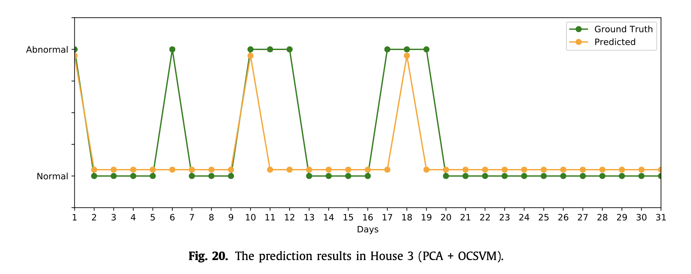

# TSI: Time series to imaging based model for detecting anomalous energy consumption in smart buildings

>论文 ：Time series to imaging based model for detecting anomalous energy consumption in smart buildings

------

[toc]

## 1. 背景

人类活动释放了大量温室气体导致了全球变暖，带来一系列灾难后果。而城市化正是原因之一，随着城市化发展，用电量越来越大，电能消耗产生了大量温室气体，但是这些电能消耗有不少的部分是由于浪费造成的，为了减少这种浪费，越来越多的国家开始使用**智能电表**来监控能耗。它不需要在建筑物内有任何额外的设置，因而可以很容易地在商业和住宅环境中应用。许多国家成功部署了这项技术，包括英国、美国、德国、中国、瑞士、丹麦和巴西。**智能仪表能够测量从几秒钟到几分钟的能源使用情况，并将此信息以单变量时间序列数据的形式传输到智能电网 。** **收集的日志仅包含两列：时间戳和整数值（即千瓦时的能耗）。**智能仪表持续不断地每几秒记录一次。例如，在英国部署的智能电表可以每 6 ~ 8 秒记录一次能耗。这样，将收集大量数据。分析这些数据以识别异常能源消耗是一项挑战，因为信息有限且计算成本高昂。这种分析可以在四个不同的级别进行：

1. 长期分析（年）
2. 中期分析（月）
3. 短期分析（周）
4. 非常短期的分析（天甚至小时）

此文主要研究第四个级别的分析，用以检测**住宅建筑中的异常能源消耗**

## 2. 现状

目前处理这种大规模数据的方式还是需要域专家的经验，进行一些基于领域知识基础的、手动的特征提取。然而，域专家无法提供最佳功能集，因为当住宅建筑的社会经济特征（例如，人口数量、电器数量、就业状况等）因建筑物而异时，环境可能会变得非常复杂。

最近出现了一种**将时间序列数据重新组织为图像**的方法，使机器学习模型能够更准确、更高效地学习类化和识别任务 。此类方法可能是处理智能电表日志的潜在解决方案之一，可以用于识别住宅建筑中的异常能耗模式。

在以往的许多论文中，从简单的统计方法发展到复杂的非监督学习模型，提出了许多方法。然而，高昂的计算成本和领域专业知识需求限制了它们在真实场景中的适用性。

为了克服这些限制，此文中作者提出了一种替代方法，无需领域专家参与即可将时间序列数据转换为 2D 图像。它能够保留时间序列的特征，以区分正常和异常的能耗模式。此外，该模型降低了存储信息的成本，因此具有一定的实用价值。

## 3. 模型

### 3.1 方法概要

1. 用TSI模型自动从单变量时间序列数据中提取多个要素
2. 使用 MTF将它们编码为 2D 图像。
   1. 一个维表示马尔科夫过渡概率
   2. 另一个维体现时间依赖性。
3. 接着采用一级支持向量机进行分类，好处如下：
   1. 它不需要异常数据
   2. 它能够区分正常能源消耗模式和所有其他可能的复杂异常例。因此，在预测阶段，它可以识别日常能源消耗中的正常和异常模式。

### 3.2 具体内容

#### 3.2.1 数据预处理

**智能计量数据作为时间序列（即时间戳、能耗值）存储在日志文件中**。该系列的采样周期约为 8 秒，定义了一个 30 分钟的**非重叠窗口**来分割连续时间序列数据。下图提供了以 30 分钟为窗口进行分段的一周能耗数据，并保留平均值以进行进一步处理。
		可以看到异常能量消耗的识别不是一个直截了当的过程。例如，无法设置阈值将分段窗口分类为正常或异常，因此需要提取一些有意义的特征。

#### 3.2.2 特征提取

这一阶段采用了一种基于可扩展假设检验的方法（也称为 TSFRESH），使用时序列特征提取库自动提取要素。它通过结合 63 个时间序列特征的方法加快这一过程，这些方法共计算了 794 个描述性时间序列特征，从简单均值到功率光谱密度。提取的主要功能如下。此库在应用于数据流的分布式和并行处理时非常高效。

#### 3.2.3 马尔可夫变换生成图像

其理念是通过马尔科夫过渡概率来保持功能和紧凑信息的交互关系。它通过以下步骤实现：

1. 第一步通过符号聚合近似和计算条柱来量化要素空间。
2. 第二步计算马尔科夫过渡矩阵，将量化要素空间视为马尔科夫链。
3. 最后，从过渡矩阵计算马尔科夫过渡字段。

与直接存储日志和自动提取功能相比，**此方法可降低存储成本**。通过成像过程对要素空间进行编码后，获取保留时态信息的要素空间快照。单日图像如下图所示。

#### 3.2.4 利用OCSVM进行分类

在提议的模型中，将能耗分类为正常或异常是基于OCSVM。OCSVM 是一种监督式学习模型，能够通过正常样本值的信息进行学习。它通过内核函数将能耗数据转换为高维要素空间。然后迭代地找到最最大边距超平面，该平面使用松弛参数将训练数据与原点分离。其中超平面的起源被视为异常数据点。它有能力围绕日常能源消耗构建边界。在测试阶段，任何超出定义边界的实例都被视为异常模式，因为异常点在数量上偏离了正常的能耗观测值。因此，目标函数试图最大限度地区分原点和所有正观测结果。

在此阶段，模型被训练以了解正常的能耗模式。下图是模型的训练过程。

对单变量时间序列数据进行预处理，并在对能耗模式进行训练后保存模型。在训练阶段，因为只有正常的能耗模式，所以将数据按 70% 和 30% 的比例分开分别进行训练和验证。在OCSVM训练期间，我们选择需要一个参数v的线性内核，其值应为(0, 1]的间隔。在我们的培训过程中，它设置为 0.1。这对应于训练误差分数的上限和支持向量分数的下限。我们从实验中获得v值，它可能在不同的问题中有所不同，被用来在测试阶段对正常和异常的能耗模式进行分类。

## 4.测试

### 4.1 数据集

实验在 [REFIT 电气负载测量数据集](https://www.researchgate.net/publication/312267812_An_electrical_load_measurements_dataset_of_United_Kingdom_households_from_a_two-year_longitudinal_study)上执行。

* **简介**

  ​		此数据集包含智能电表读数和各个设备能耗。数据集是在英国的20栋房屋中用两年时间收集的。在数据收集过程中，住户们正在执行他们通常的例行公事。能耗取决于居住者人数、电器数量和卧室数量。因此，概括模型可能会误导异常，因为每栋房子都有不同的能耗模式。实验通过考虑不同的社会经济特征进行。

* **规模**                  

* **下载链接：** https://www.researchgate.net/publication/312267812_An_electrical_load_measurements_dataset_of_United_Kingdom_households_from_a_two-year_longitudinal_study

* **数据示例**

此外，没有有关数据集中是否存在异常的信息。然而，这并不意味着它们不存在。在接下来的实验中，将会生成增强异常来评估模型的性能。

### 4.2 测试

### 4.2.1 TSI model 在3个不同房子的数据上的测试结果

### 4.2.2 测试没有imaging这一步效果如何

证明了image的重要性，这个结果可以看出没有image模型几乎检测不到异常

### 4.2.3 主成分分析结果

给TSI模型的准确性做个参照，可以看到主成分分析的结果准确率只有50%左右

## 5. 总结和展望

智能电表为收集高分辨率电力数据及其分析提供了绝佳的机会，适用于各种潜在应用，包括检测异常能耗。本文提出了一个TSI模型来处理智能电表的数据流，将每天的消耗分类为正常或异常。我们的方法通过自动提取描述性和代表性特征，重新放松了域专家的限制。我们将此信息压缩为 2D 图像。我们的分类模型基于OCSVM来了解能耗的不良行为，任何偏差都被认为是异常的。**实验在真实世界的公开可用数据集上进行**，以证明 TSI 模型的适用性。**我们的 F1 得分为 88%，与最先进的方法相比，F1 得分高出 24%。**
		在未来的工作中，我们计划每天检测设备级别的异常行为。我们将扩展此模型，以获得**建筑内不同电器的时间序列图像**。我们还计划**将此模型作为手持设备的服务，供消费者查看能源使用模式。**