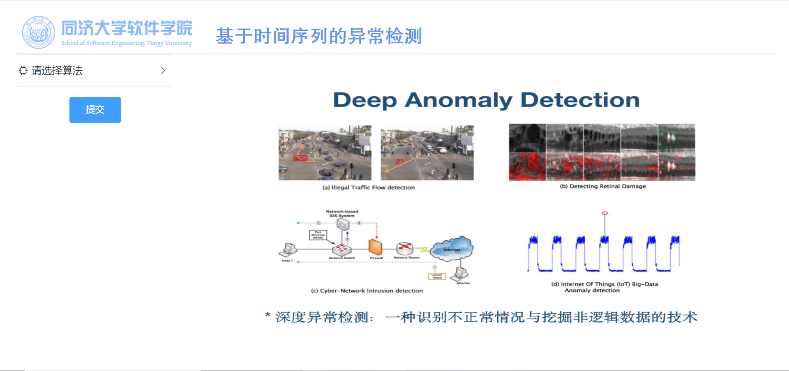
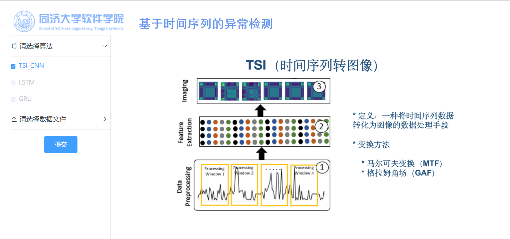
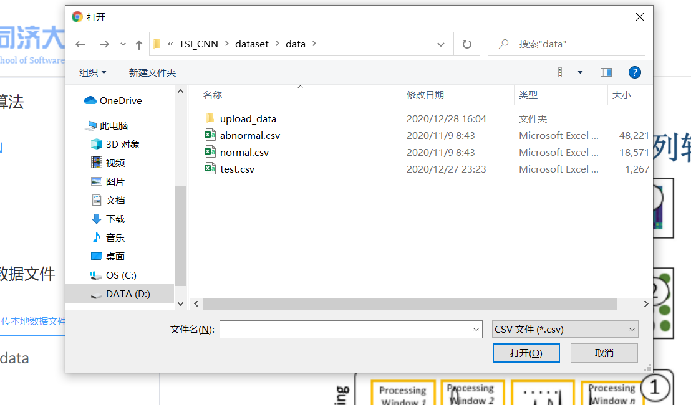
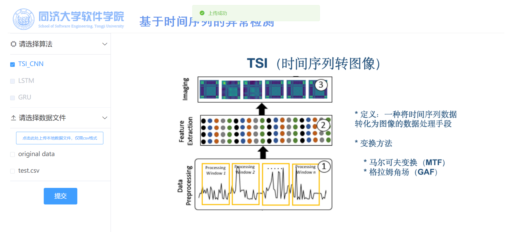
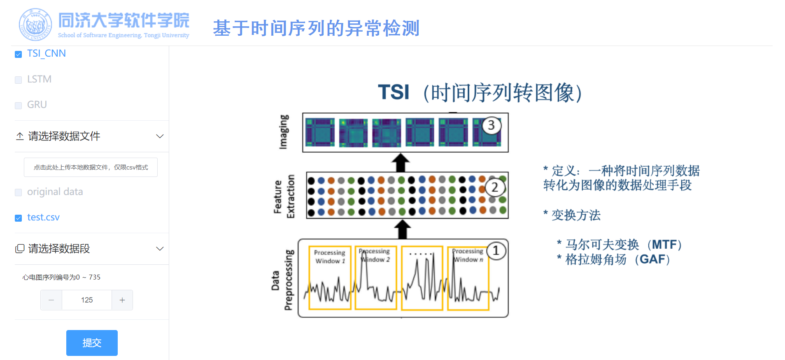
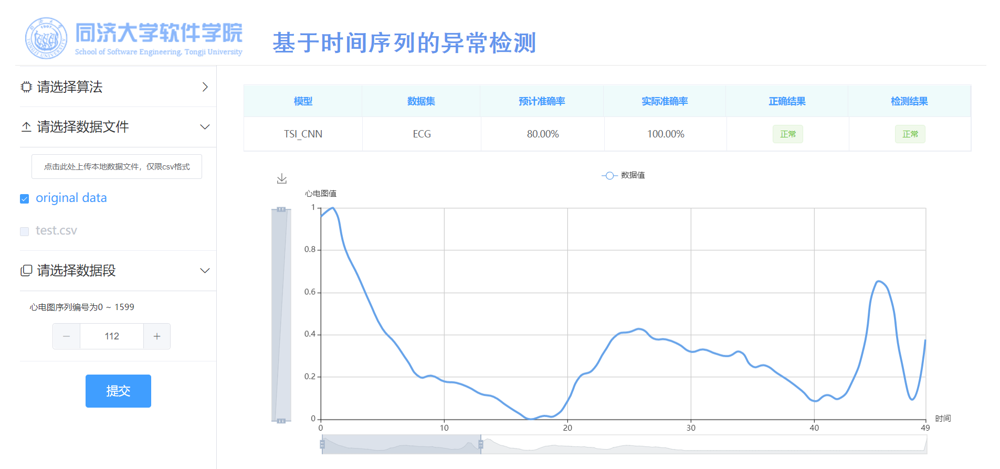
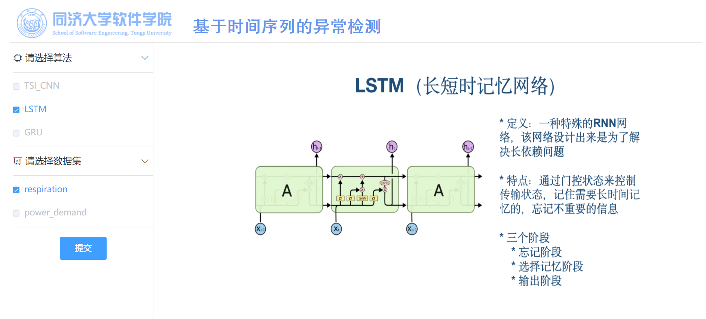
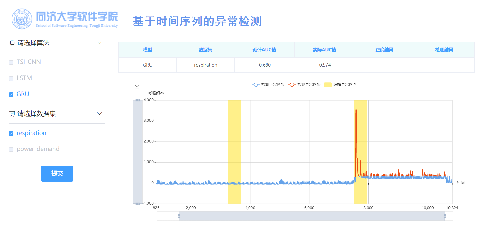

# Front-end using manual

### 1. Run the project

We could input the command below in the root directory to start the project.

```shell
python manage.py runserver 8000
```

And then we enter the following URL into the address bar in your browser to access the page.

```
http://127.0.0.1:8000/index/
```

Then we can see the following page which indicates that we’ve run the project successfully.



### 2. Basic introduction

When we enter the page, we will see the welcome page with basic introduction of the project. 


And when we select one model, we will also see the basic introduction of the model.



### 3. Use TSI_CNN model

At first, we should select model ‘TSI_CNN’ and the file selection form will display.

Then, we can upload a data file. If we want to use default data file, this step can be skipped.



If uploaded successfully, there will be a message informing of that.



Then we need to input the section we want to use.



Then click ‘submit’ and after several seconds, the result will display in the page.



### 4. Use RNN Model

Also in the beginning we need to choose a RNN model (LSTM or GRU), and the data set selection form will display.


Then we need to choose a dataset.



Then click ‘submit’ and the result will display in the page.


